# SecureShare — Implementation Walkthrough
### Section 3.3: Sample Output

---

## 1. User Registration & Login

Registration creates a unique RSA-2048 key pair for the user. The private key is immediately encrypted using AES-256-GCM with a key derived from the user's password via PBKDF2 before being stored in the database. The server never holds the private key in plaintext.

**Register:**

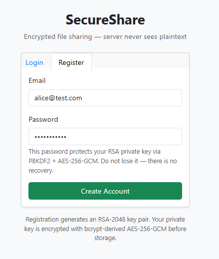

**Login (confirmation of RSA key pair generation):**

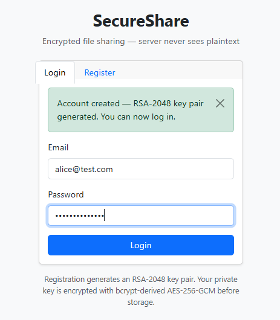

---

## 2. File Upload & Encryption

When a file is uploaded, the system:
1. Computes a cryptographic hash of the **plaintext** file before encryption
2. Generates a fresh random 256-bit File Encryption Key (FEK) via `os.urandom`
3. Encrypts the file using the selected algorithm and a fresh nonce
4. Wraps the FEK with the user's RSA-2048 public key (OAEP padding)
5. Stores only the ciphertext, wrapped FEK, nonce, and hash — never the plaintext

The user may select any combination of encryption and hash algorithm.

---

### AES-256-GCM + SHA-256

SHA-256 produces a **64-character** hex digest (256 bits).

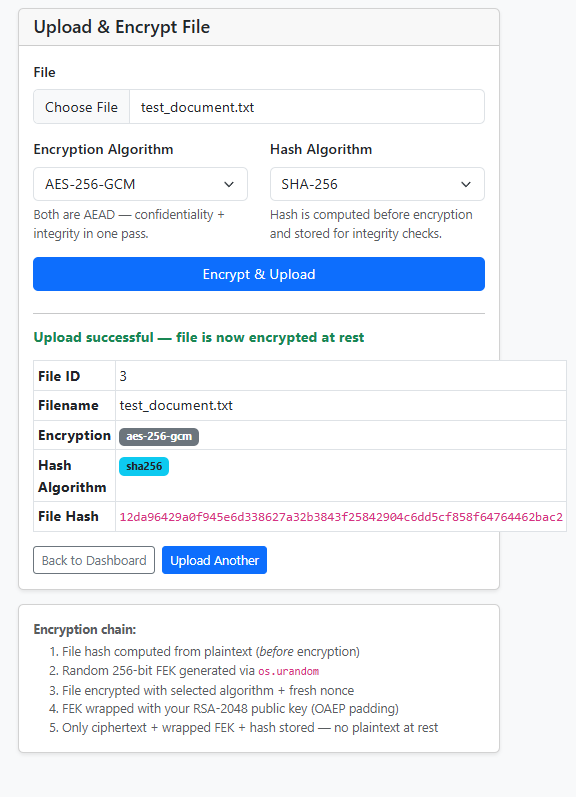

---

### ChaCha20-Poly1305 + SHA-256

Same file, different encryption algorithm. The hash is identical — proving the hash is computed on the plaintext, not the ciphertext.

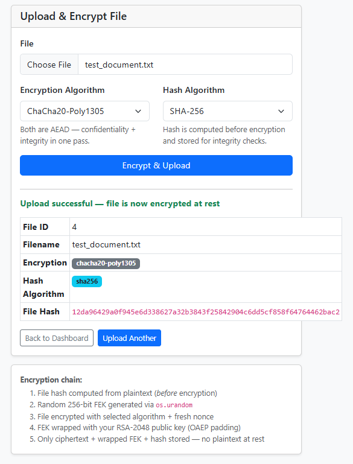

---

### AES-256-GCM + SHA-512

SHA-512 produces a **128-character** hex digest (512 bits) — twice the length of SHA-256, offering a higher security margin.

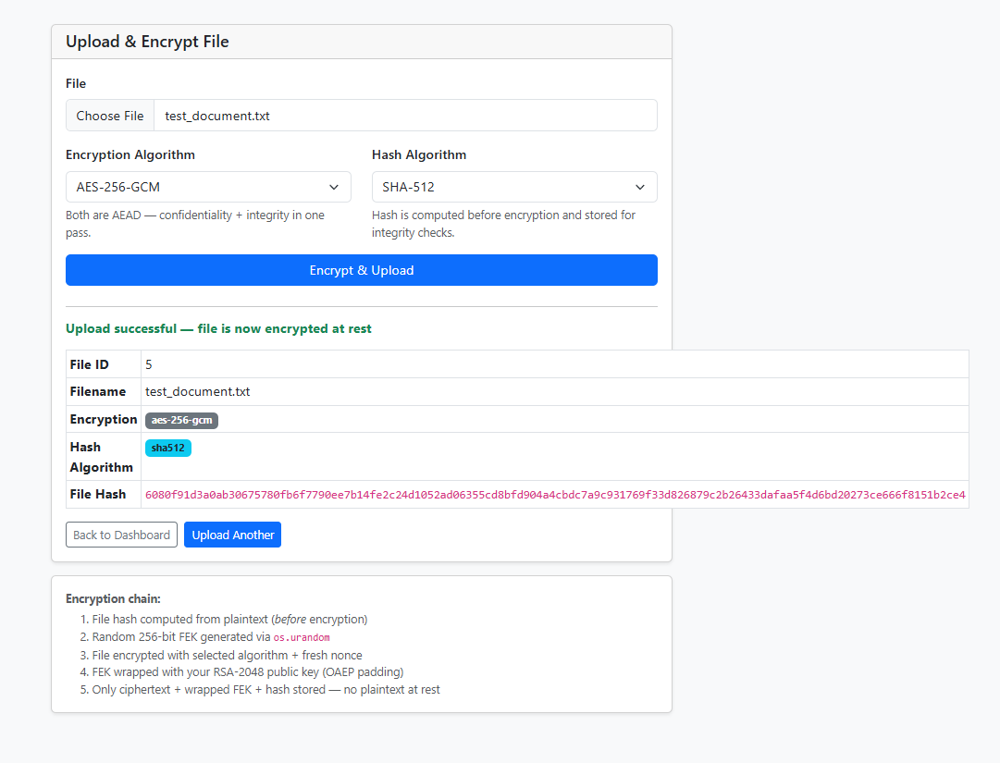

---

### ChaCha20-Poly1305 + SHA-512

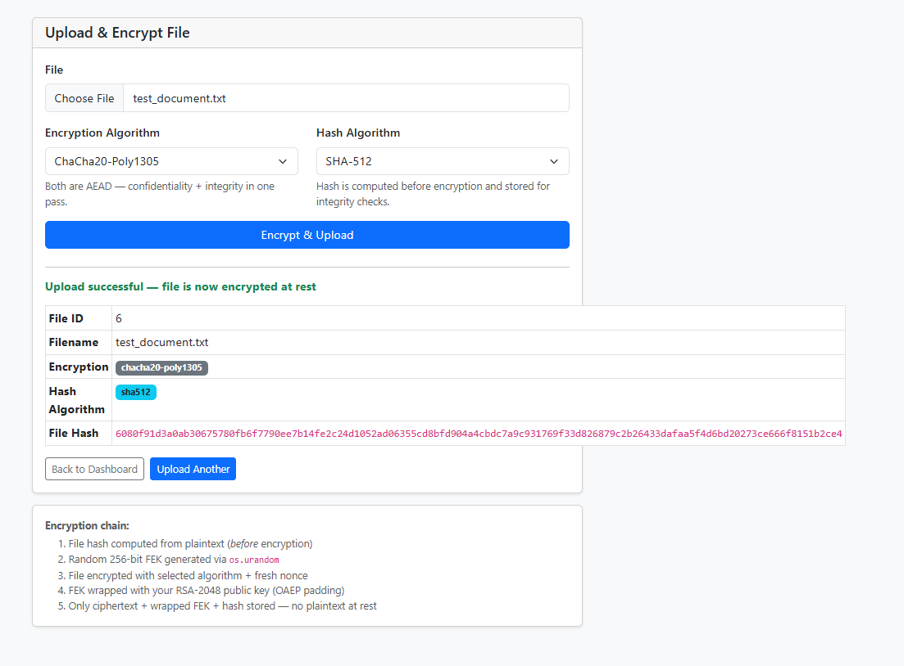

---

### AES-256-GCM + MD5 ⚠️

MD5 produces a **32-character** hex digest (128 bits). The system flags MD5 with a visible warning: it is cryptographically broken and included for demonstration purposes only. Practical collision attacks against MD5 were demonstrated at Crypto 2004.

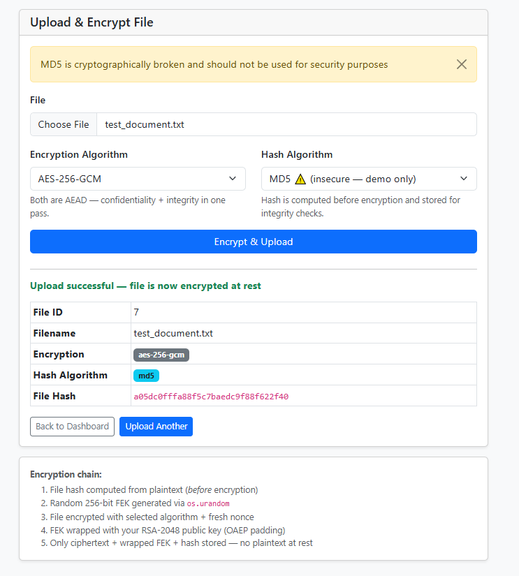

---

### ChaCha20-Poly1305 + MD5 ⚠️

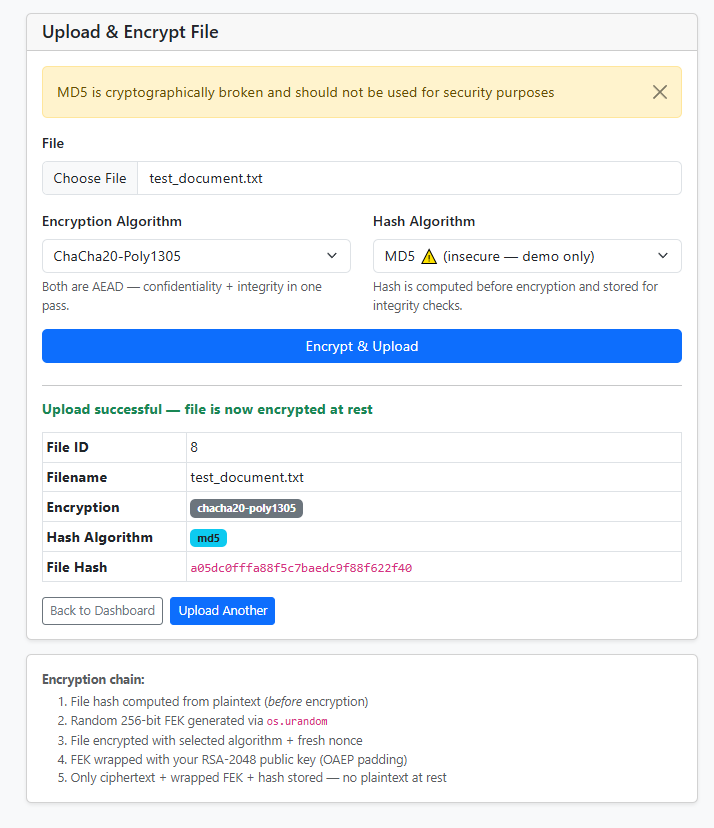

---

### Hash Digest Comparison — Same File, Three Algorithms

| Algorithm | Digest Length | Output (File ID 3) |
|-----------|--------------|---------------------|
| SHA-256 | 64 hex chars | `12da96429a0f945e...` |
| SHA-512 | 128 hex chars | `6080f91d3a0ab306...` |
| MD5 ⚠️ | 32 hex chars | `a05dc0fffa88f5c7...` |

Note that files 3 and 4 (AES vs ChaCha20, both SHA-256) produce the **same hash** — confirming the hash is a property of the plaintext content, not the encryption algorithm applied to it.

---

## 3. Downloading Securely — Integrity Check PASS

To decrypt a file, the user provides their login password. The system runs the full decryption chain:

1. `PBKDF2(password + stored salt)` → AES key
2. AES-256-GCM decrypts the private key blob → RSA private key
3. RSA-OAEP unwraps the wrapped FEK → raw 32-byte FEK
4. AES-GCM / ChaCha20 decrypts the ciphertext (authentication tag verified)
5. Hash of the decrypted plaintext is recomputed and compared to the stored hash

If the stored hash matches the recomputed hash, the file is confirmed authentic and unmodified.

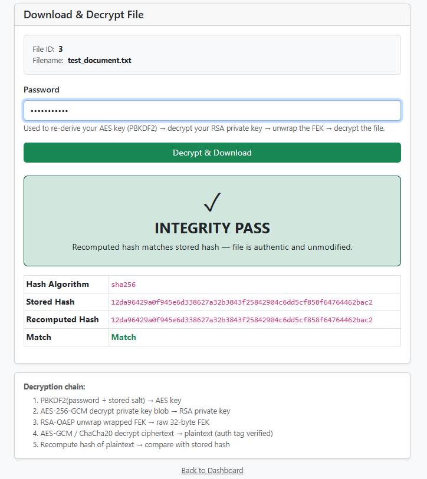

The **Stored Hash** and **Recomputed Hash** fields are identical, and the Match field shows **Match** in green — confirming the file has not been tampered with since upload.

---

## 4. File Sharing Between Users

### Sharing a File

`bob@test.com` shares `test_document_2.txt` (File ID 9) with `alice@test.com`. The share operation:
1. Decrypts Bob's private key using his password
2. Unwraps the FEK using Bob's private key
3. Re-wraps the same FEK using Alice's RSA public key (fetched from DB)
4. Stores a new Share record containing Alice's wrapped FEK

The file ciphertext is **never duplicated** — only the key is re-wrapped. The server never sees the raw FEK at any point.

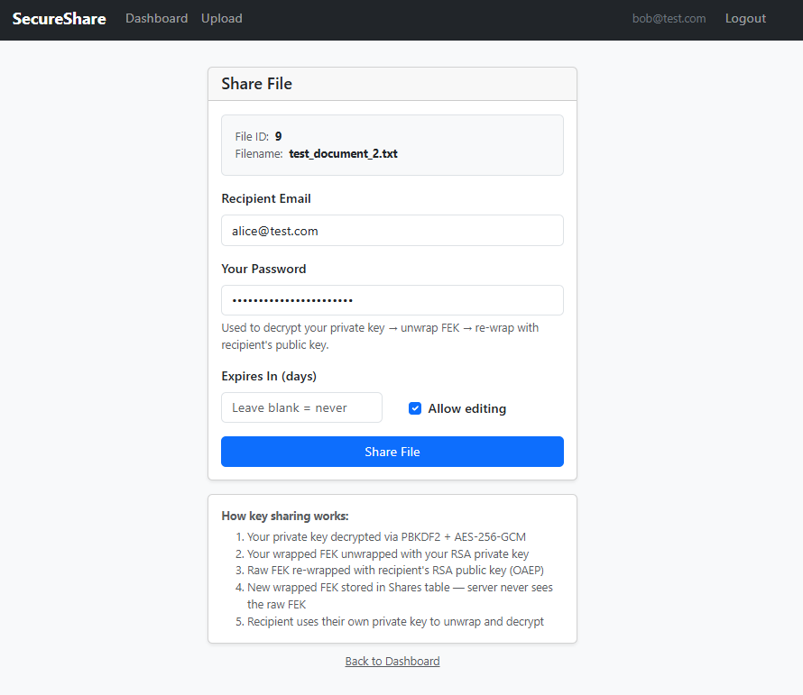

---

### Alice Receives the Shared File

Alice's dashboard shows the file in the **Shared With Me** section, including the owner, encryption algorithm, hash algorithm, expiry, and whether she has edit permission.

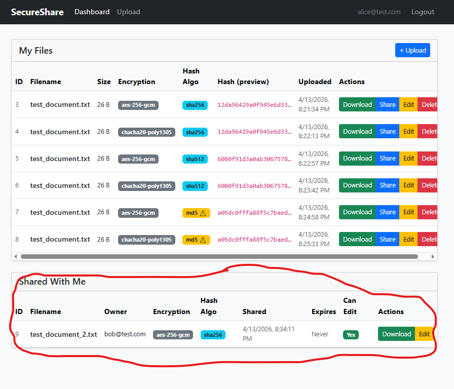

---

### Alice Downloads the Shared File Using Her Own Password

Alice decrypts the file using **her own password** — not Bob's. Her copy of the wrapped FEK was encrypted with her RSA public key, so only her private key (unlocked by her password) can unwrap it.

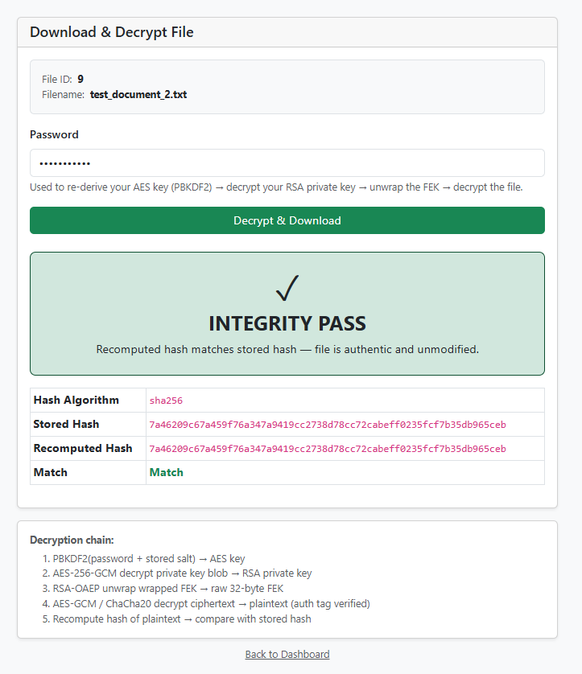

Integrity PASS confirms the file arrived intact and unmodified.

---

## 5. Editing a Shared File

When a file is edited, the system performs a full cryptographic reset:
1. Hashes the new plaintext before encryption
2. Generates a **brand-new FEK** — the old FEK is discarded
3. Encrypts the new content with the new FEK and a fresh nonce
4. Re-wraps the new FEK for the owner using the owner's public key
5. Loops through **every existing Share record** and re-wraps the new FEK for each recipient using their public key
6. Updates the File record and all Share records atomically

No manual re-sharing is required. Recipients automatically receive access to the updated file through their re-wrapped FEK.

**Alice edits File ID 9** (`test_document_2.txt` → `test_document_2-1.txt`):

- Original content: `"This is the test document number 2!"`
- Edited content: `"This is the test document number 2-1!"`

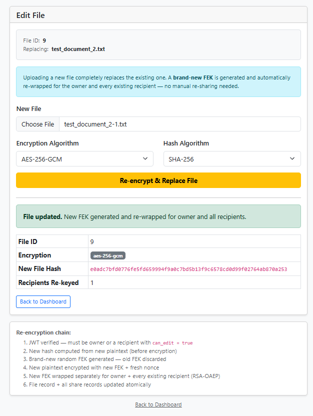

`Recipients Re-keyed: 1` confirms the new FEK was re-wrapped for Bob automatically.

---

### Bob Sees the Updated File

After Alice's edit, Bob's dashboard reflects the new filename and updated hash — without Alice needing to re-share.

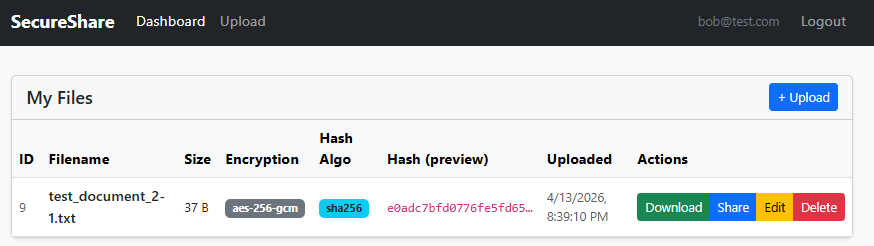

---

### Bob Downloads the Edited File — Integrity PASS

Bob downloads the edited file using his own password. The integrity check passes against the new hash generated at edit time.

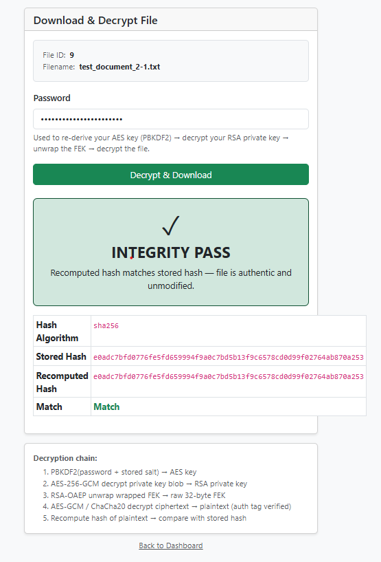

---

## 6. Deleting a File

Only the file owner can delete a file. Deletion removes the ciphertext, nonce, wrapped FEK, all metadata, and all Share records in a single cascaded operation. Once deleted, no recipient retains access.

**Bob deletes `test_document_2-1.txt`:**

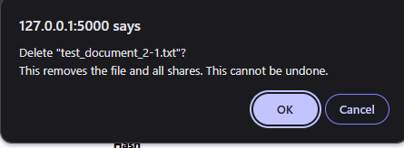

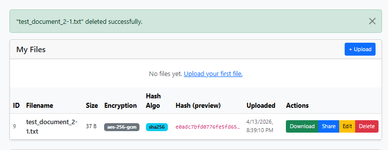

---

### Alice Loses Access After Deletion

Alice's dashboard no longer shows the file in the Shared With Me section — the Share record was deleted as part of the cascade.

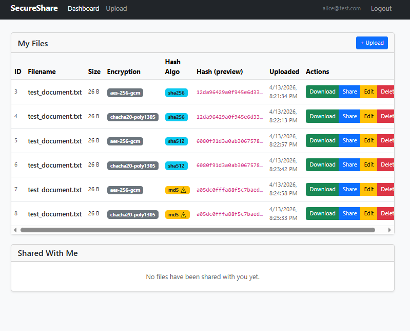

---

## Summary

| Feature | Evidence |
|---------|----------|
| AES-256-GCM encryption | Upload screenshots — enc_algo badge |
| ChaCha20-Poly1305 encryption | Upload screenshots — enc_algo badge |
| SHA-256 hash (64 chars) | Hash field in upload response |
| SHA-512 hash (128 chars) | Hash field in upload response |
| MD5 broken algorithm warning | Yellow warning banner on upload |
| Integrity check PASS | Download screenshots — Match field green |
| Zero-knowledge server model | FEK always wrapped, private key always encrypted |
| File sharing — FEK re-wrap | Share page — key sharing steps listed |
| Recipient decrypts with own password | Alice download using her password |
| Edit with full re-encryption | Recipients Re-keyed counter |
| Cascaded deletion | Alice loses access after Bob deletes |
